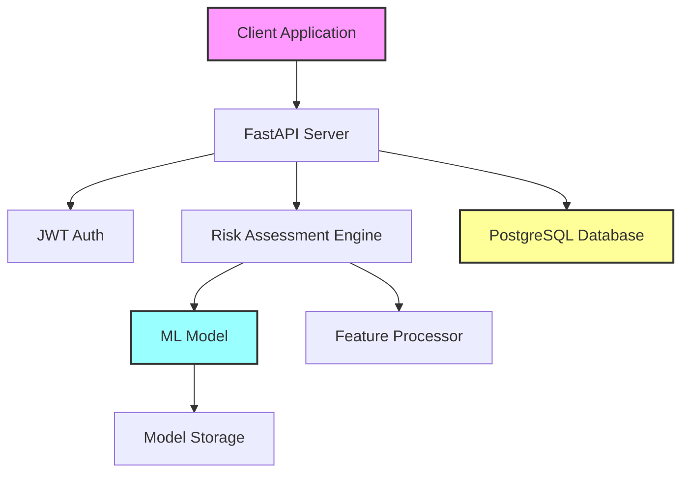

# NeuroRiskLogic 🧠

[](https://www.python.org/downloads/)
[](https://fastapi.tiangolo.com/)
[](https://opensource.org/licenses/MIT)
[](https://github.com/psf/black)

## Overview

NeuroRiskLogic is an AI-powered risk assessment system for neurodevelopmental disorders. It uses machine learning to analyze clinical and sociodemographic factors, providing healthcare professionals with evidence-based risk predictions without requiring explicit diagnostic labels.

### Key Features

- 🔍 **Comprehensive Risk Assessment**: Analyzes 18 clinical and sociodemographic features
- 🤖 **Machine Learning Powered**: Uses Random Forest classification with interpretable results
- 🔐 **Secure API**: JWT authentication for protected endpoints
- 📊 **Detailed Analytics**: Risk factor identification and clinical recommendations
- 🚀 **Production Ready**: Built with FastAPI, PostgreSQL, and modern Python practices
- 📈 **Model Retraining**: Dynamic model updates as new data becomes available

## Table of Contents

- [Architecture](#architecture)
- [Quick Start](#quick-start)
- [API Documentation](#api-documentation)
- [Features](#features)
- [Development](#development)
- [Deployment](#deployment)
- [Contributing](#contributing)
- [Clinical Context](#clinical-context)
- [License](#license)

## Architecture



### Tech Stack

- **Backend Framework**: FastAPI 0.104.1
- **ML Framework**: scikit-learn 1.3.2
- **Database**: PostgreSQL 15+ (SQLite for development)
- **Authentication**: JWT with python-jose
- **Data Validation**: Pydantic v2
- **ORM**: SQLAlchemy 2.0

## Quick Start

### Prerequisites

- Python 3.9 or higher
- PostgreSQL 15+ (or use SQLite for development)
- Git

### Installation

1. **Clone the repository**
```bash
git clone https://github.com/yourusername/NeuroRiskLogic.git
cd NeuroRiskLogic
```

2. **Create virtual environment**
```bash
python -m venv venv

# On Windows
venv\Scripts\activate

# On macOS/Linux
source venv/bin/activate
```

3. **Install dependencies**
```bash
pip install -r requirements.txt
```

4. **Set up environment variables**
```bash
cp .env.example .env
# Edit .env with your configuration
```

5. **Initialize the database**
```bash
# The database tables will be created automatically on first run
python -c "from app.database import init_db; init_db()"
```

6. **Generate synthetic data and train initial model** (Optional)
```bash
python scripts/generate_synthetic_data.py
python scripts/train_model.py
```

7. **Run the application**
```bash
uvicorn app.main:app --reload --host 0.0.0.0 --port 8000
```

8. **Access the API**
- API Documentation: http://localhost:8000/docs
- ReDoc Documentation: http://localhost:8000/redoc
- Health Check: http://localhost:8000/health

## API Documentation

### Authentication

Most endpoints require JWT authentication. To get a token:

```bash
curl -X POST "http://localhost:8000/api/v1/auth/login" \
     -H "Content-Type: application/json" \
     -d '{"api_key": "your-api-key-here"}'
```

Use the token in subsequent requests:
```bash
curl -H "Authorization: Bearer <your-token>" \
     http://localhost:8000/api/v1/assessments
```

### Core Endpoints

#### 1. Risk Prediction (Public)
```http
POST /api/v1/predict
```

Make a risk prediction without storing data:

```json
{
  "age": 25,
  "gender": "M",
  "consanguinity": false,
  "family_neuro_history": true,
  "seizures_history": false,
  "brain_injury_history": false,
  "psychiatric_diagnosis": true,
  "substance_use": false,
  "suicide_ideation": false,
  "psychotropic_medication": true,
  "birth_complications": false,
  "extreme_poverty": false,
  "education_access_issues": false,
  "healthcare_access": true,
  "disability_diagnosis": false,
  "social_support_level": "moderate",
  "breastfed_infancy": true,
  "violence_exposure": false
}
```

Response:
```json
{
  "risk_score": 0.72,
  "risk_level": "high",
  "confidence_score": 0.89,
  "risk_factors": [
    "Family history of neurological disorders",
    "Existing psychiatric diagnosis",
    "Currently on psychotropic medication"
  ],
  "protective_factors": [
    "Access to healthcare",
    "Moderate social support"
  ],
  "recommendations": [
    "Immediate comprehensive neurodevelopmental evaluation recommended",
    "Genetic counseling may be beneficial",
    "Ensure ongoing psychiatric care and medication compliance"
  ]
}
```

#### 2. Submit Assessment (Public)
```http
POST /api/v1/assessments
```

Submit and store a full assessment with consent.

#### 3. Get Assessments (Protected)
```http
GET /api/v1/assessments?limit=10&offset=0
```

Retrieve paginated list of assessments.

#### 4. System Statistics (Protected)
```http
GET /api/v1/stats
```

Get comprehensive system statistics and analytics.

### Feature Definitions

The system analyzes 18 evidence-based features:

| Category | Features |
|----------|----------|
| **Clinical-Genetic** | Consanguinity, Family neurological history, Seizures, Brain injury, Psychiatric diagnosis, Substance use, Suicide ideation, Psychotropic medication |
| **Sociodemographic** | Birth complications, Extreme poverty, Education access, Healthcare access, Disability diagnosis, Social support level, Breastfeeding history, Violence exposure |
| **Demographics** | Age, Gender |

## Development

### Project Structure

```
NeuroRiskLogic/
├── app/
│   ├── models/         # Database and ML models
│   ├── routes/         # API endpoints
│   ├── schemas/        # Pydantic validation
│   ├── utils/          # Utility functions
│   ├── main.py         # FastAPI application
│   ├── config.py       # Configuration
│   ├── database.py     # Database setup
│   └── auth.py         # Authentication
├── scripts/
│   ├── generate_synthetic_data.py
│   ├── train_model.py
│   └── evaluate_model.py
├── data/
│   ├── models/         # Trained ML models
│   └── synthetic/      # Generated data
├── tests/              # Test suite
├── docs/               # Additional documentation
└── requirements.txt
```

### Running Tests

```bash
# Run all tests
pytest

# Run with coverage
pytest --cov=app --cov-report=html

# Run specific test file
pytest tests/test_predictor.py
```

### Code Quality

```bash
# Format code
black .

# Lint code
flake8 app/

# Type checking
mypy app/
```

### Database Migrations

Using Alembic for database migrations:

```bash
# Create a new migration
alembic revision --autogenerate -m "Add new column"

# Apply migrations
alembic upgrade head

# Rollback
alembic downgrade -1
```

## Deployment

### Docker Deployment

```dockerfile
FROM python:3.11-slim

WORKDIR /app

COPY requirements.txt .
RUN pip install --no-cache-dir -r requirements.txt

COPY . .

CMD ["uvicorn", "app.main:app", "--host", "0.0.0.0", "--port", "8000"]
```

Build and run:
```bash
docker build -t neurorisklogic .
docker run -p 8000:8000 --env-file .env neurorisklogic
```

### Production Deployment

1. **Environment Variables**
   - Set `ENV=production`
   - Use strong `SECRET_KEY`
   - Configure PostgreSQL connection
   - Set appropriate CORS origins

2. **Database**
   - Use PostgreSQL 15+
   - Enable connection pooling
   - Regular backups

3. **Security**
   - HTTPS only
   - Rate limiting
   - Input validation
   - Regular security updates

4. **Monitoring**
   - Application metrics
   - Error tracking (Sentry)
   - Performance monitoring
   - Health checks

### Cloud Deployment Options

- **Heroku**: One-click deployment with Procfile
- **AWS**: EC2 + RDS or ECS + Fargate
- **Google Cloud**: Cloud Run or App Engine
- **Azure**: App Service or Container Instances

## Contributing

We welcome contributions! Please see our [Contributing Guidelines](CONTRIBUTING.md) for details.

### Development Workflow

1. Fork the repository
2. Create a feature branch (`git checkout -b feature/amazing-feature`)
3. Commit your changes (`git commit -m 'feat: Add amazing feature'`)
4. Push to the branch (`git push origin feature/amazing-feature`)
5. Open a Pull Request

### Commit Convention

We use conventional commits:
- `feat:` New features
- `fix:` Bug fixes
- `docs:` Documentation changes
- `style:` Code style changes
- `refactor:` Code refactoring
- `test:` Test additions/changes
- `chore:` Maintenance tasks

## Clinical Context

This system implements evidence-based screening for neurodevelopmental disorders based on established clinical risk factors. It is designed to assist healthcare professionals in identifying individuals who may benefit from comprehensive evaluation.

### Important Notes

- This is a **screening tool**, not a diagnostic system
- Results should be interpreted by qualified healthcare professionals
- The system complements, but does not replace, clinical judgment
- All assessments require explicit consent

### Research Foundation

The risk factors and scoring system are based on:
- Peer-reviewed clinical literature
- Epidemiological studies
- Expert clinical consensus
- WHO guidelines on neurodevelopmental disorders

## License

This project is licensed under the MIT License - see the [LICENSE](LICENSE) file for details.

## Acknowledgments

- FastAPI team for the excellent framework
- scikit-learn community for ML tools
- Clinical advisors and domain experts
- Open source contributors

## Contact

- **Author**: Samuel Campozano Lopez
- **Email**: samuelco860@gmail.com
- **LinkedIn**: Samuel Campozano Lopez

---

  Made with ❤️ for improving neurodevelopmental healthcare accessibility
